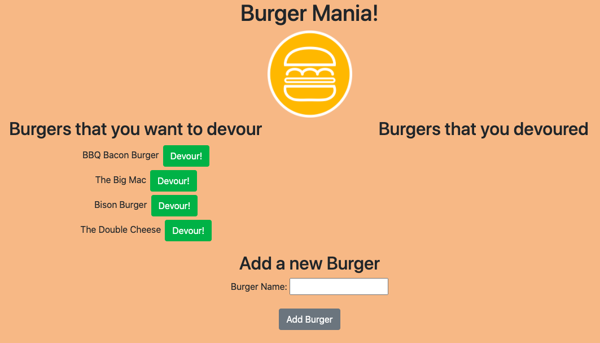
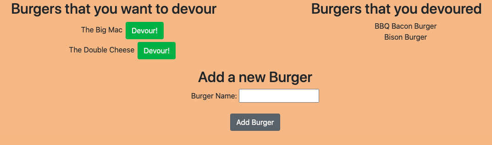

 
  # Burger Mania

  ## Description 
  
  The application allows a user to enter different burgers they want to eat and store them into the program. Once a burger is added, it is first in the "burgers I want to devour column". Then the user can move them over to the "burgers that have been devoured" section once they have eaten them.
  
  
  ## Table of Contents (Optional)
  
  * [Installation](#installation)
  * [Usage](#usage)
  
  
  ## Installation
  
  Make sure you have Node installed. After you have cloned down the repository, make sure to run NPM Install to install all of the dependencies. Then using the schema provided, create a MySQL database called burgers_db and link it to the application. Run node server.js to begin the program.
  
  
  ## Usage 
  
  The application utilizes a MySQL database that stores and displays the burgers within the program. Once a new burger is added by the user, it is inserted into the database and rendered in the appropriate location depending on if it has been devoured or not. The program also used handlebars to create and render the HTML.
  

  ## Badges
  
  
  
  
  ## Contributing
  
  Kieran Lynch
  

  ## Screenshots

  Homepage:

  

  After a burger has been eaten, the user can click 'Devour' which will move it over to the list of devoured burgers:

  
